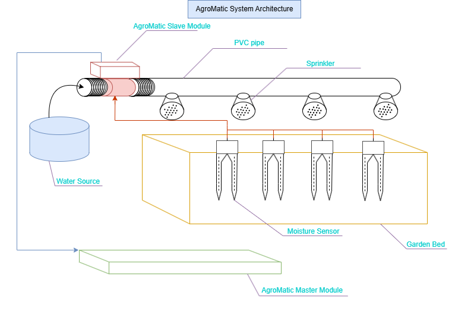
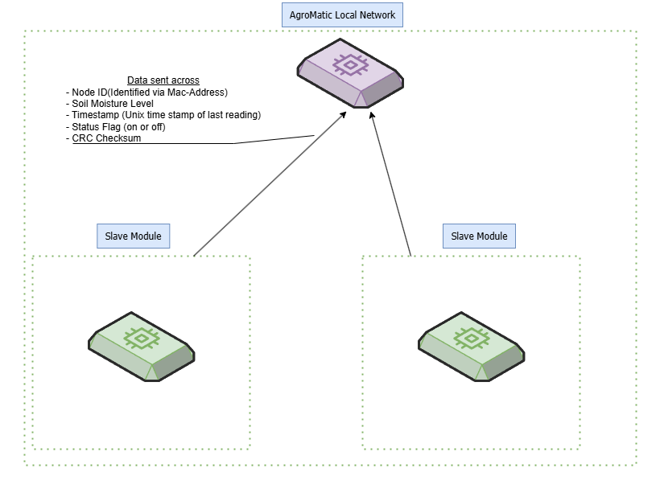
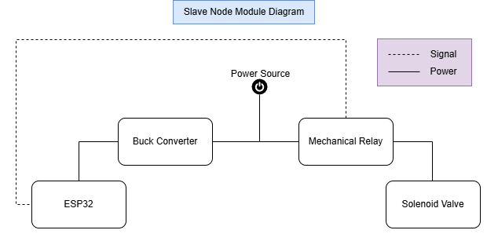

# PROJECT: AGRO_MATIC  
🌱 **Automated Irrigation Control System**  

## Table of Contents  
1. [Abstract](#abstract)  
2. [Features](#features)  
3. [Hardware Requirements](#hardware-requirements)  
4. [System Architecture](#system-architecture)  
5. [Circuit Design](#circuit-design)  
6. [Software Requirements](#software-requirements)  
7. [Installation & Setup](#installation--setup)  
8. [Contributing](#contributing)  
9. [Roadmap](#roadmap)  

---

## Abstract  
Traditional irrigation methods waste water and lack real-time adaptability. **AgroMatic** implements a decentralized smart system using ESP-NOW communication between slave nodes and a master hub. Each slave module autonomously monitors soil moisture via capacitive sensors and controls irrigation solenoids, while the master aggregates data and relays it to the cloud. Built on ESP32 microcontrollers, this mesh-network approach reduces water usage by up to 30% while enabling scalable farm deployments.

---

## Features  
- **Decentralized Control**: Slave nodes operate independently using ESP-NOW protocol.
- **Mesh Network Architecture**: Master ESP32 aggregates data from multiple slave units.
- **Real-Time Monitoring**: Capacitive soil sensors prevent over/under-watering.
- **Cloud Integration** *(Will be implemented later on)*: Master node exports metrics to IoT platforms (ThingSpeak/Cayenne).
- **Low-Power Operation**: Optimized for battery-powered slave units with deep sleep modes.
- **Modular Design**: Easily add/remove slave nodes without system reconfiguration.
- **Fail-Safe Operation**: Local decision making continues if cloud connectivity is lost.

---

## Hardware Requirements  
### Slave Node (Per Unit)
1. **ESP32 Microcontroller** (WiFi + Bluetooth)
2. **Capacitive Soil Moisture Sensor** 
3. **12V Solenoid Valve**
4. **Mechanical Relay Module**
4. **Buck Converter** (12V to 5V) – *for stable ESP32 power supply*
4. **Batter Pack** - 12V 5A.
5. **Weatherproof Enclosure**

### Master Node
1. **ESP32 Microcontroller** (with permanent power supply)

---

## System Architecture  
### System Architecture Diagram
  
### Network Topology Diagram (*Cloud architechture not included*)

### Logic Control Diagram (*Slave Node Module*)

1. **Slave Nodes** (Field Units):
   - Collect soil moisture data
   - Control local solenoid valves
   - Transmit data via ESP-NOW
   - Battery-powered operation

2. **Master Hub**:
   - Aggregates data from all slaves
   - Maintains real-time system status
   - Pushes data to cloud via WiFi (*Optional*)

3. **Data Sent from Slave to Master**:
   
   Each slave node transmits the following data packet to the master node over ESP-NOW:
   - **Node ID (1 byte)** – Unique identifier for the slave node (Mac Address).  
   - **Soil Moisture Level (2 bytes)** – Raw ADC reading from capacitive sensor. 
   - **Timestamp (4 bytes)** – Unix time of last reading.
   - **Status Flags (1 byte)** – Irrigation Status (On or Off).  
   - **CRC Checksum (2 bytes)** – Ensures data integrit   


---

## Circuit Design  
  

---

## Software Requirements  
- **PlatformIO** (VS Code extension recommended)
- **ESP-NOW Library** (peer-to-peer communication)
- **ArduinoJSON** (data packet formatting)
- **ThingSpeak/Cayenne** (cloud integration)
- **FastLED** (for status indicators - optional)

---

## Installation & Setup  
1. **Clone the Repository**:  
   ```bash  
   git clone https://github.com/yourusername/Agromatic.git  
   cd Agromatic

## Deliverables  
1. [ ] **Slave Module Enclosure Design**  
   - 3D-printed waterproof case for ESP32 + sensor  
   - Mounting points for soil probe and battery pack  

2. [ ] **Capacitive Sensor Calibration**  
   - Documented voltage-to-moisture conversion table 

3. [ ] **Battery Runtime Optimization**  
   - Achieve 45-day operation on 2x18650 batteries  
   - Deep sleep current <10μA between measurements  

4. [ ] **Solenoid Driver Circuit**  
   - Tested MOSFET control circuit schematic  
   - Over-current protection implementation
   - Potential relay?  

5. [ ] **ESP-NOW Packet Structure**  
   - Defined binary protocol for sensor data (12-byte packets)  
   - CRC error checking implementation  

6. [ ] **Master Node Dashboard**  
   - Basic serial console interface showing:  
     - Connected slave count  
     - Last received timestamps  
     - Irrigation status per node

7. [ ] **Cloud Platform**:
   - Stores historical data
   - Provides remote monitoring dashboard
   - Sends mobile alerts 